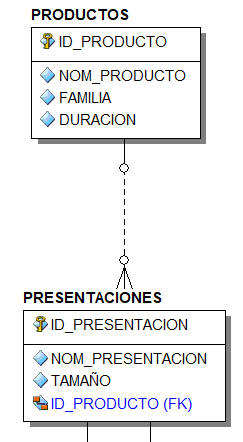
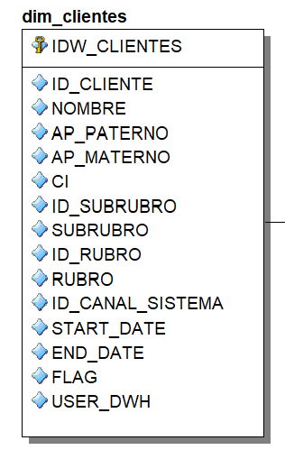
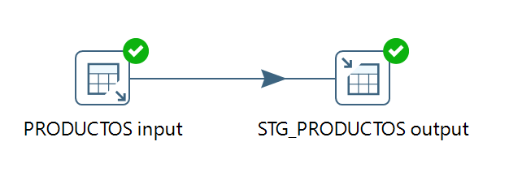
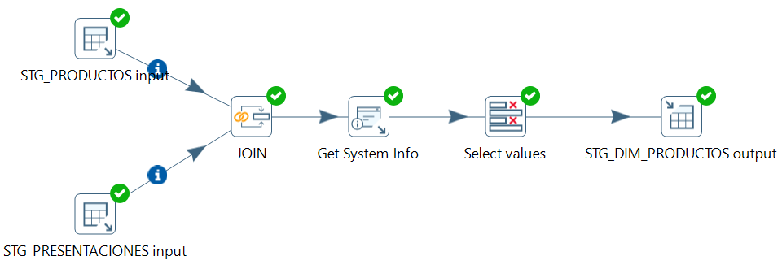
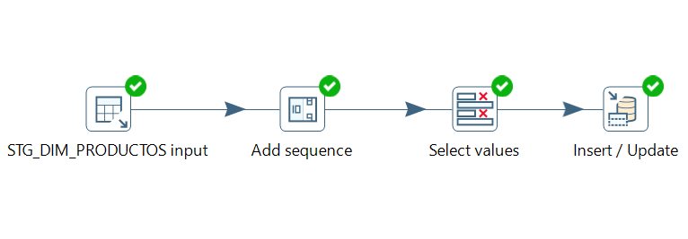

# ETL - Distribuidora (_Retail_)

Se realiza la construcción de un **proceso ETL** de un negocio del área de _**Retail**_, partiendo de un modelo OLTP hacia un modelo OLAP; mediante scripts con la ayuda de la herramienta **Toad for Oracle** y, de igual manera por interfaz gráfica con **Pentaho DI**.

<p align="center">
  
</p>


### Descripción de las herramientas:
Las herramientas que se utilizaron para el desarrollo del Proyecto son:

- [x] **_Embarcadero ER/Studio 8.0:_** para el diseño ER de los modelos OLTP (_Entidades y Relaciones_) y OLAP (_Dimensiones y Hechos_).
- [x] **_Toad for Oracle 13.0:_** para la Extracción, Transformación y Carga de los datos (_mediante Scripts_).
- [x] **_Pentaho Data Integration 9.2.0 (_Spoon_):_** para el proceso ETL a través de interfaz gráfica, realizando conexiones a base de datos **Oracle** y **PostgreSQL**.

Para el desarrollo del proyecto en la construcción del proceso ETL se consideraron las siguientes fases:

* Diseño de diagramas E-R OLPT y OLAP
* Creación de la Base de Datos: _DISTRIBUIDOR_
* Proceso ETL con Scripts SQL
* Proceso ETL con Pentaho DI (_Spoon_)


## Diseño de diagramas E-R: OLTP y OLAP
En primera instancia se realiza el diseño del diagrama Entidad-Relación, denominado _“Modelo Transaccional Distribuidor”_, con la ayuda de la herramienta **Embarcadero ER/Studio**. Posteriormente diseñar el diagrama OLAP a partir del diagrama OLTP, denominado _“Modelo Dimensional Distribuidor”_, como se observan a continuación:

* Modelo Transaccional Distribuidor (_OLTP_), como ejemplo tenemos a las entidades “PRODUCTOS” y “PRESENTACIONES”.

<p align="center">
  
</p>

* Modelo Dimensional Distribuidor (_OLAP_), como ejemplo tenemos a la dimensión “dim_clientes”.

<p align="center">
  
</p>

- [x] Ingresar a la carpeta **“0_Esquema_OLTP_y_OLAP”**, para ver los diagramas completos que se encuentran en formato ***.DM1**.


## Creación de la Base de Datos: DISTRIBUIDOR
En esta fase se crea una base de datos relacional, con el nombre de _DISTRIBUIDOR_; implementando en el gestor de base de datos **Oracle** mediante Scripts (_código SQL, tablas_), que dichos Scripts se obtuvieron del **modelo OLTP** con la ayuda de la herramienta **Embarcadero ER/Studio**.

Como ejemplo de código SQL para la creación de las tablas, se tiene a continuación:

```sql
--
-- TABLE: CIUDADES
--
CREATE TABLE CIUDADES(
    ID_CIUDAD     NUMBER(38, 0)    NOT NULL,
    NOM_CIUDAD    VARCHAR2(100),
    ID_DEPTO      NUMBER(38, 0),
    CONSTRAINT CIUDADES_PK PRIMARY KEY (ID_CIUDAD)
)
;
```

Además, se tiene código SQL para la carga de los datos (_inserts_), como ser:

```sql
--
-- TABLE: CIUDADES
--
Insert into CIUDADES (ID_CIUDAD, NOM_CIUDAD, ID_DEPTO) Values (1, 'ARTIGAS', 2);
Insert into CIUDADES (ID_CIUDAD, NOM_CIUDAD, ID_DEPTO) Values (2, 'BELLA UNION', 2);
Insert into CIUDADES (ID_CIUDAD, NOM_CIUDAD, ID_DEPTO) Values (3, 'CANELONES', 3);
```

- [x] Ingresar a la carpeta **“1_Fuente_Distribuidor”**, para ver los Scripts completos del _modelo OLTP_.


## Proceso ETL con Scripts SQL
En esta fase se realiza el proceso ETL con la ayuda de Scripts en **código SQL**. Para tal efecto se debe crear 3 bases de datos en **Oracle** con los nombres:

* **DISTRIBUIDOR**. Esta base de datos se utilizará como fuente de **_extracción_** de datos.
* **STAGE**. En esta base de datos se realiza la **_transformación_** de los datos con procedimientos almacenados.
* **STAR**. En esta base de datos se efectuará la **_carga_** de los datos.

- [x] **Nota:** Al crear estas bases de datos se encuentran vacías, excepto el de DISTRIBUIDOR, porque ya se creó con anterioridad.

Para el desarrollo de la fase, se considera tomar el orden de las siguientes sub etapas:


### 1. Distribuidor
Comenzamos con otorgar privilegios SQL de **SELECT**, a la base de datos STAGE desde la base de datos DISTRIBUIDOR. Para tal efecto, se tiene como ejemplo el siguiente código para ejecutar en la base de datos **DISTRIBUIDOR**.

```tsql
GRANT SELECT ON CIUDADES TO STAGE;
```

- [x] Ingresar a la carpeta **“2_Proceso_ETL_con_Script/1_Distribuidor”**, para ver el Script completo de los permisos (_privilegios_).


### 2. Star
Se realiza la creación de la base de datos STAR mediante Scripts (_código SQL_), a través del modelo dimensional distribuidor **OLAP**, que se obtienen con la ayuda de la herramienta **Embarcadero ER/Studio**.

Un pequeño ejemplo de código SQL:

```sql
-- 
-- TABLE: dim_productos 
--
CREATE TABLE dim_productos(
    idw_productos       NUMBER(10, 0)    NOT NULL,
    id_presentacion     NUMBER(10, 0)    NOT NULL,
    presentacion        VARCHAR2(100),
    tamanio             VARCHAR2(100),
    id_producto         NUMBER(10, 0)    NOT NULL,
    producto            VARCHAR2(100),
    familia             VARCHAR2(100),
    duracion            VARCHAR2(100),
    id_canal_sistema    NUMBER(10, 0),
    start_date          DATE,
    end_date            DATE,
    flag                NUMBER(1, 0),
    user_dwh            VARCHAR2(100),
    CONSTRAINT PK_DIM_PRODUCTOS PRIMARY KEY (idw_productos)
)
;
```

Luego otorgamos privilegios SQL de **SELECT, INSERT, UPDATE** y **DELETE** a la base de datos STAGE desde la base de datos STAR, es decir:

```tsql
GRANT SELECT, INSERT, UPDATE, DELETE ON DIM_PRODUCTOS TO STAGE;
```

- [x] Ingresar a la carpeta **“2_Proceso_ETL_con_Script/2_Star”**, para ver los Scripts completos.


### 3. Stage
En esta etapa se realiza la transformación y carga de los datos con procedimientos almacenados mediante Scripts SQL, ejecutando estos Scripts en la base de datos **STAGE**.

  _**a. Estructura de la base de datos STAGE**_

Se realiza la creación de **estructuras** de tablas, **secuencias** para las tablas dimensionales y **tabla de procesos** para observar las ejecuciones de los procedimientos en la base de datos STAGE.

```sql
CREATE TABLE STG_PRODUCTOS
NOLOGGING
AS
SELECT * FROM distribuidor.productos
where rownum<1 ;
```

_**b. Extracción de los datos**_

Se realiza la extracción de los de datos: de DISTRIBUIDOR hacia STAGE, mediante el siguiente procedimiento:

```tsql
CREATE OR REPLACE PROCEDURE ETL_STG_PRODUCTOS IS
```

_**c. Transformación de los datos**_

Se realiza la transformación o creación de tablas Dimensionales y Hechos, es decir: del modelo OLTP hacia el modelo OLAP, mediante el siguiente procedimiento:

```tsql
CREATE OR REPLACE PROCEDURE ETL_STG_DIM_PRODUCTOS
```

_**d. Carga de los datos**_

Luego se efectúa la carga de nuevos datos o actualización de los datos de STAGE hacia STAR, mediante el siguiente procedimiento:

```tsql
CREATE OR REPLACE PROCEDURE ETL_DIM_PRODUCTOS
```

_**e. Ejecución de los procedimientos**_

Y finalmente se realiza la ejecución del proceso ETL, ejecutando los procedimientos creados anteriormente (_tomar en cuenta el orden de los procedimientos_), es decir:

```tsql
-- DIM PRODUCTO

exec ETL_STG_PRODUCTOS;
exec ETL_STG_PRESENTACIONES;
exec ETL_STG_DIM_PRODUCTOS;
exec ETL_DIM_PRODUCTOS;

SELECT * FROM STAR.DIM_PRODUCTOS;
```

- [x] Ingresar a la carpeta **“2_Proceso_ETL_con_Script/3_Stage”**, para ver los Scripts completos.


## Proceso ETL con Pentaho DI (_Spoon_)
La herramienta de Pentaho DI tiene un componente denominado **Spoon** que nos facilita en la construcción de un proceso ETL, mediante una interfaz gráfica e intuitiva.

Para lo cual realizaremos el mismo proceso ETL, con una diferencia de manejar dos gestores de bases de datos: **Oracle** para la extracción de datos y **PostgreSQL** para la carga de los datos, y por ende Pentaho DI (_Spoon_) se encargará de la transformación de los datos y la conexión a Oracle y PostgreSQL.

Ya que anteriormente se creó una base de datos en Oracle con el nombre de DISTRIBUIDOR (es decir, se cuenta con esta base de datos), ahora se creará dos bases de datos en PostgreSQL con los nombres de **STAGE2** y **STAR2**.


### 1. Extracción
Comenzaremos con la extracción de los datos: de DISTRIBUIDOR hacia STAGE2, con la **transformación: ETL_STG_PRODUCTOS**, que dicho proceso es denominado _transformación_ en la herramienta Spoon.

A continuación, se observa el diagrama creado con la herramienta Spoon de Pentaho DI.

<p align="center">
  
</p>

- [x] Ingresar a la carpeta **“3_Proceso_ETL_con_Pentaho_DI/1_Stage_1”**, para ver las _Transformaciones_ completas ya creadas.


### 2. Transformación
Se continua con la transformación de los datos en la base de datos STAGE2, con la **transformación: ETL_STG_DIM_PRODUCTOS**, es decir:

<p align="center">
  
</p>

- [x] Ingresar a la carpeta **“3_Proceso_ETL_con_Pentaho_DI/2_Stage_2”**, para ver las _Transformaciones_ completas ya creadas.


### 3. Carga
Y finalmente se realiza la carga de los datos en la base de datos STAGE2, con la transformación: **ETL_DIM_PRODUCTOS**, es decir, en esta transformación realiza tanto la inserción como la actualización de los datos.

<p align="center">
  
</p>

- [x] Ingresar a la carpeta **“3_Proceso_ETL_con_Pentaho_DI/3_Star”**, donde se tienen las Transformaciones completas ya creadas.


